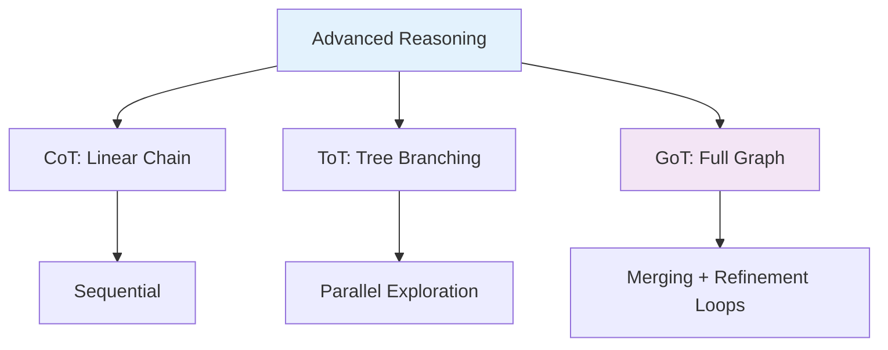

# Prompting Frameworks: CoT, ToT & GoT

**The ultimate resource for mastering advanced LLM reasoning techniques.**

## Overview

| Framework | Structure | Best For | Performance Gain |
|-----------|-----------|----------|------------------|
| **Chain of Thought (CoT)** | Linear | Step-by-step reasoning | Baseline |
| **Tree of Thoughts (ToT)** | Branching Tree | Exploration, planning, puzzles | + significant on search tasks |
| **Graph of Thoughts (GoT)** | Arbitrary Graph (merging, loops) | Complex synthesis, creativity | +62% on sorting vs ToT (original paper) |

## Bird's Eye View

## Contents
- [CoT Guide](docs/cot.md)
- [ToT Guide](docs/tot.md)
- [GoT Guide](docs/got.md)
- [Prompt Library](/prompts/)
- [Examples](/examples/)

**Star this repo if you find it useful!** 🚀