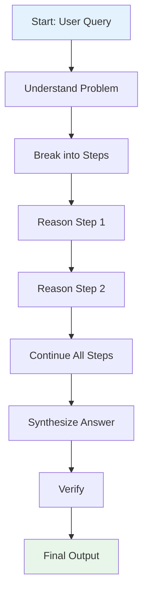
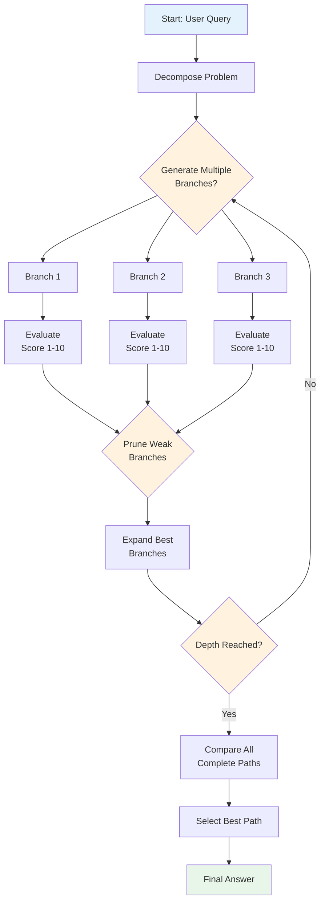
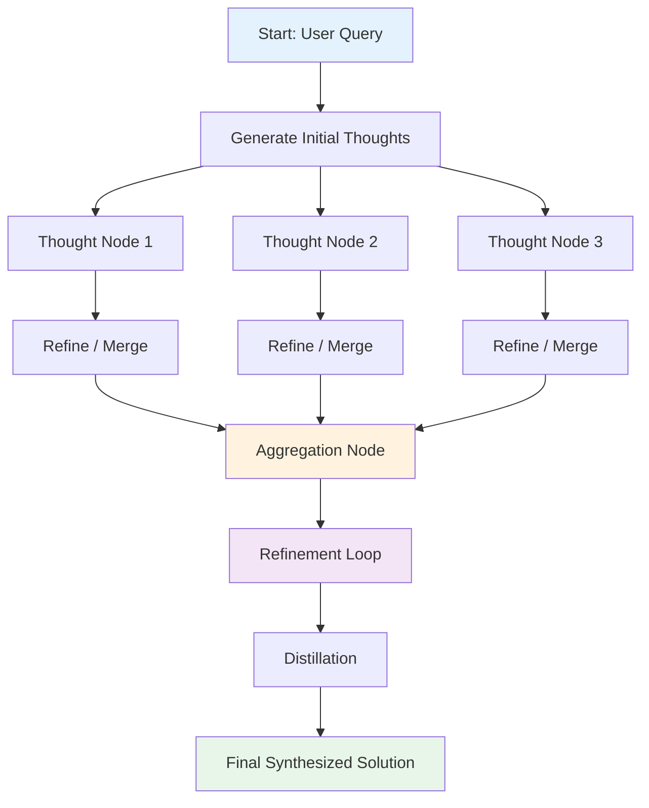

# Prompting Frameworks: CoT, ToT & GoT

Comprehensive visual guide to advanced reasoning techniques for LLMs like Grok.

## Flowcharts

### 1. Chain of Thought (CoT)

### 2. Tree of Thoughts (ToT)

### 3. Graph of Thoughts (GoT)

## Bird's Eye View Comparison

| Framework | Structure | Key Operations | Best Use Cases | Complexity |
|-----------|-----------|----------------|----------------|------------|
| **CoT** | Linear Chain | Sequential steps | Standard reasoning, math, logic | Low |
| **ToT** | Tree (Branching) | Branch, Evaluate, Prune | Planning, puzzles, search | Medium |
| **GoT** | Arbitrary Graph | Merge, Refine, Aggregate, Loops | Complex synthesis, creativity, strategy | High |

**Visualization Summary**: CoT is a straight line → ToT is a tree with branches → GoT is a full interconnected graph with merging and feedback loops.

Clone this repo and open README.md in any Markdown viewer that supports Mermaid (GitHub, VS Code, Obsidian, etc.).