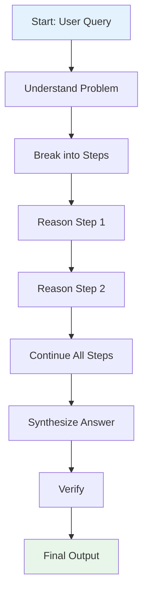

# Chain of Thought (CoT)

```mermaid
flowchart TD
    A[Start: User Query] --> B[Understand Problem]
    B --> C[Break into Steps]
    C --> D[Reason Step 1]
    D --> E[Reason Step 2]
    E --> F[Continue All Steps]
    F --> G[Synthesize Answer]
    G --> H[Verify]
    H --> I[Final Output]
    
    style A fill:#e3f2fd
    style I fill:#e8f5e9
```
