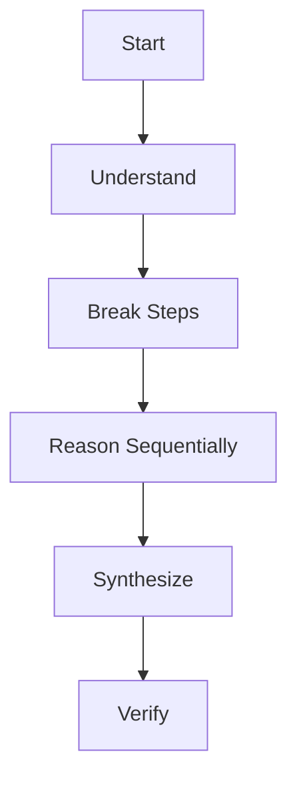

# Chain of Thought (CoT)

**Linear step-by-step reasoning.**

## Mermaid Flowchart

```mermaid
flowchart TD
    A[Start] --> B[Understand] --> C[Break Steps] --> D[Reason Sequentially] --> E[Synthesize] --> F[Verify]
```

## Best Templates
... (full template here)