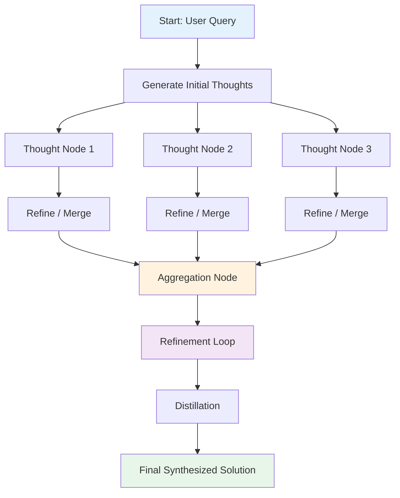

# Graph of Thoughts (GoT)

```mermaid
flowchart TD
    A[Start: User Query] --> B[Generate Initial Thoughts]
    
    B --> C1[Thought Node 1]
    B --> C2[Thought Node 2]
    B --> C3[Thought Node 3]
    
    C1 --> D1[Refine / Merge]
    C2 --> D2[Refine / Merge]
    C3 --> D3[Refine / Merge]
    
    D1 --> E[Aggregation Node]
    D2 --> E
    D3 --> E
    
    E --> F[Refinement Loop]
    F --> G[Distillation]
    
    G --> H[Final Synthesized Solution]
    
    style A fill:#e3f2fd
    style H fill:#e8f5e9
    style E fill:#fff3e0
    style F fill:#f3e5f5
```
