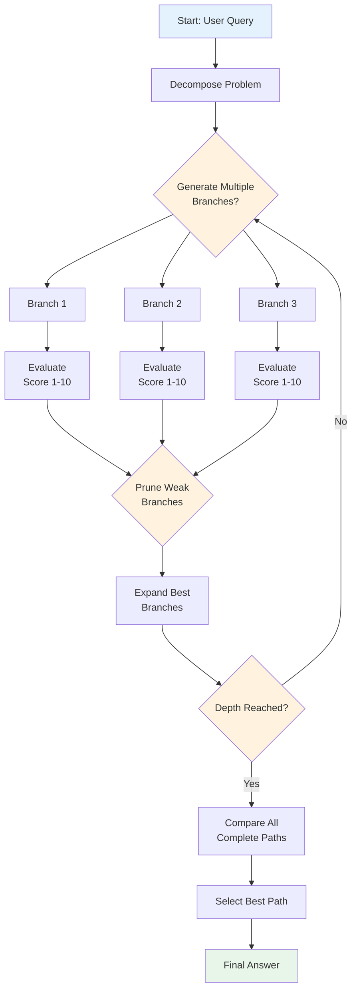

# Tree of Thoughts (ToT)

```mermaid
flowchart TD
    A[Start: User Query] --> B[Decompose Problem]
    B --> C{Generate Multiple\nBranches?}
    
    C --> D1[Branch 1]
    C --> D2[Branch 2]
    C --> D3[Branch 3]
    
    D1 --> E1[Evaluate\nScore 1-10]
    D2 --> E2[Evaluate\nScore 1-10]
    D3 --> E3[Evaluate\nScore 1-10]
    
    E1 --> F{Prune Weak\nBranches}
    E2 --> F
    E3 --> F
    
    F --> G[Expand Best\nBranches]
    G --> H{Depth Reached?}
    
    H -->|No| C
    H -->|Yes| I[Compare All\nComplete Paths]
    
    I --> J[Select Best Path]
    J --> K[Final Answer]
    
    style A fill:#e3f2fd
    style K fill:#e8f5e9
    style C fill:#fff3e0
    style F fill:#fff3e0
    style H fill:#fff3e0
```
